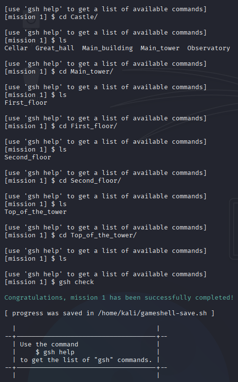
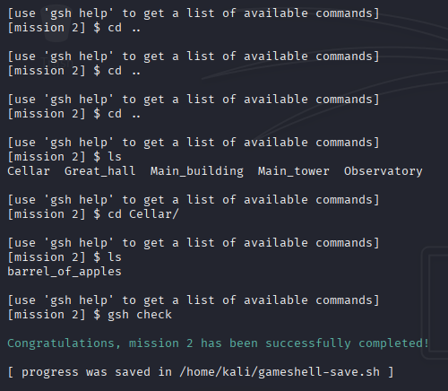
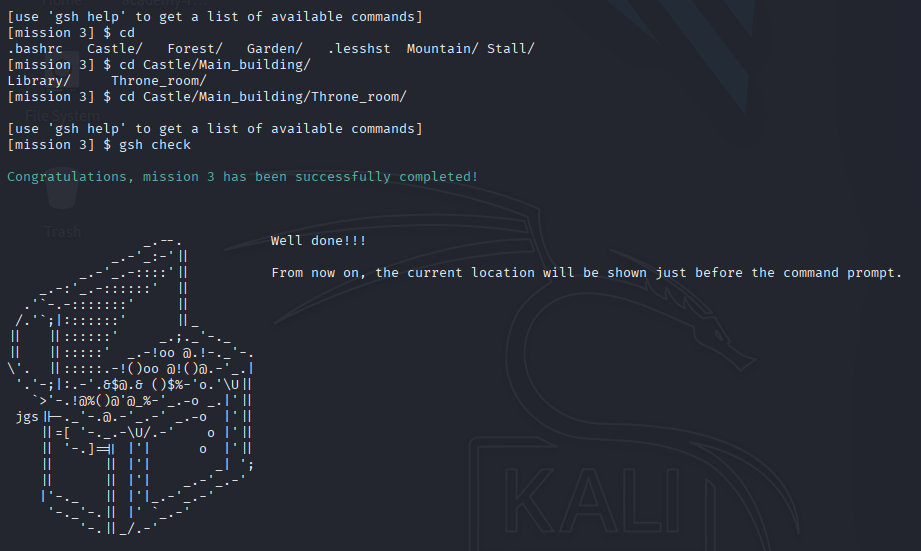
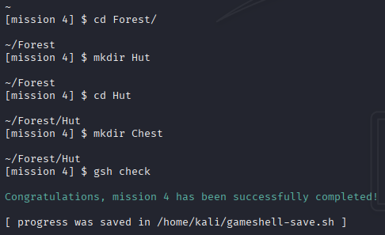

# GameShell - Guida Completa alle 44 Missioni

## Introduzione

GameShell è un gioco educativo per imparare i comandi Linux attraverso missioni interattive. Questo documento riporta le soluzioni e gli apprendimenti delle 44 missioni completate.

### Mission 1
Qui si tratta semplicemente di entrare nella cartella Castle/Main_tower fino a raggiungere l'ultima sottocartella Top_of_the_tower.



### Mission 2
Qui lo scopo della missione è quello di tornare indietro fino alla directory Castle ed entrare nella directory Cellar. L'utilizzo del comando `cd ..` è fondamentale.



### Mission 3
Qui si torna nella directory iniziale con il comando `cd`, dopo di che ci si sposta utilizzando il path assoluto Castle/Main_building/Throne_room.



### Mission 4
In questo task ci spostiamo nella cartella World/Forest e creiamo una cartella chiamata Hut. Dopodiché entriamo nella cartella creata e ne creiamo un'altra chiamata Chest.



### Mission 5
In questo task ci spostiamo nella cartella World/Castle/Cellar ed eliminiamo tutti i file che iniziano con la parola spider.

**Soluzione**:
```bash
cd World/Castle/Cellar
rm spider*
```

### Mission 6
Ci spostiamo nella cartella Garden e muoviamo con il comando `mv` tutti i file coin_* nella cartella Garden/Hut/Chest.

**Soluzione**:
```bash
cd Garden
mv coin_* Hut/Chest/
```

### Mission 7
Stessa missione di prima ma in questo caso i coin fanno riferimento a file nascosti. Per vederli si deve utilizzare il comando `ls -la` all'interno della cartella Garden.

**Soluzione**:
```bash
cd Garden
ls -la
mv .coin_* Hut/Chest/
```

### Mission 8
Qui possiamo rimuovere tutti i file richiesti dalla cartella Castle/Cellar utilizzando il comando `rm *spider*`. In questo modo elimineremo i file che avranno la parola spider al centro del nome del file.

**Soluzione**:
```bash
cd Castle/Cellar
rm *spider*
```

### Mission 9
Questo è come l'esercizio precedente ma i file spider sono nascosti. Si deve dire a `rm` di rimuovere i file che sono nascosti e che hanno la parola spider nel nome del file utilizzando il comando `rm .*spider*`.

**Soluzione**:
```bash
rm .*spider*
```

### Mission 10: Copiare File
In questo esercizio dobbiamo copiare i file standard_* dalla cartella Castle/Great_hall nella cartella Forest/Hut/Chest.

**Soluzione**:
```bash
cd Castle/Great_hall
cp standard_* ../../Forest/Hut/Chest/
```

---

### Mission 11: Pattern Tapestry
Adesso il nostro obiettivo è quello di copiare tutti i file che hanno il pattern XXX_tapestry_XXX nel nostro forziere. Per fare questo possiamo utilizzare il comando `cp *tapestry* ../../Forest/Hut/Chest/`.

**Soluzione**:
```bash
cp *tapestry* ../../Forest/Hut/Chest/
```

---

### Mission 12: File Meno Recente
In questo esercizio occorre listare i file con il comando `ls -l` per poter leggere la data di ultima modifica di ogni file. Poi si deve prendere il meno recente e spostarlo nel nostro forziere.

**Soluzione**:
```bash
ls -l
# Identificare il file meno recente
mv <file_meno_recente> ../../Forest/Hut/Chest/
```

---

## Utilità di Sistema

### Mission 13: Calendario
Con il comando `cal 2020` possiamo stampare a video il calendario di quell'anno e vedere che il giorno richiesto (19 ottobre 2020) era un lunedì.

**Soluzione**:
```bash
cal 2020
```

---

### Mission 14: Creare Alias
In questo esercizio impareremo a creare un alias per il comando `ls -A`. Per poter creare un alias il comando è `alias la='ls -A'`.

**Soluzione**:
```bash
alias la='ls -A'
```

---

## Editor di Testo

### Mission 15: Nano Editor
Nano è uno degli editor di testo presenti in molte delle distribuzioni Linux. Usando nano dovremo creare un file chiamato journal.txt all'interno della cartella Forest/Hut/Chest che contenga del testo.

**Soluzione**:
```bash
cd Forest/Hut/Chest
nano journal.txt
# Scrivere il testo
# Ctrl+O per salvare, Ctrl+X per uscire
```

---

### Mission 16: Alias per Journal
Gli alias sono un modo comodo per evitare di ridigitare comandi lunghi ogni volta. Utilizzando il comando `alias journal='nano ~/Forest/Hut/Chest/journal.txt'` potremo creare un alias per accedere in modo molto più comodo all'editor di testo per poter modificare il file journal.txt.

**Soluzione**:
```bash
alias journal='nano ~/Forest/Hut/Chest/journal.txt'
```

---

## Tecniche Avanzate

### Mission 17: Tab Completion
Questa è una missione a tempo. Per poter risolvere l'esercizio è necessario utilizzare la Tab completion in modo da iniziare a scrivere soltanto la parte iniziale di una cartella o di un file e poi con il tasto tab fare in modo che il terminale finisca di scrivere in modo autonomo il nome del file o della cartella.

**Soluzione**: Utilizzare il tasto Tab per auto-completare

---

### Mission 18: Background
Qui il gioco ci insegna come aprire un programma in background mettendo il carattere `&` in fondo al nome di un qualsiasi programma. Es: `mousepad&`.

**Soluzione**:
```bash
mousepad &
```

---

### Mission 19: Concatenare Comandi
In questo esercizio vediamo come il comando `&` posto in mezzo a due o più comandi ci permetta di concatenare più comandi insieme.

**Soluzione**:
```bash
comando1 && comando2 && comando3
```

---

### Missione 20: Parola Magica
Qui ci si affida alla fortuna. La parola magica di 4 lettere da abbinare al comando charmiglio è `bash`.

**Soluzione**:
```bash
charmiglio bash
```

---

## Ricerca Avanzata

### Missione 21: Navigazione Cieca
In questa missione ci muoviamo alla cieca nel labirinto, cartella per cartella per trovare il file OOOOO_copper_coin_OOOOO e spostarlo nella cartella Forest/Hut/Chest/.

**Soluzione**: Navigare manualmente attraverso le cartelle
```bash
# Una volta trovato il file
mv OOOOO_copper_coin_OOOOO ~/Forest/Hut/Chest/
```

---

### Missione 22: Comando Tree
Il task è molto simile a quello precedente ma adesso abbiamo un'arma in più. Il comando `tree` ci mostra la struttura del file system dal punto in cui ci troviamo in basso. Questo ci semplifica la vita nel riuscire a trovare e spostare il file OOOOO_silver_coin_OOOOO nel nostro forziere.

**Soluzione**:
```bash
tree
# Identificare la posizione del file
cd <percorso_corretto>
mv OOOOO_silver_coin_OOOOO ~/Forest/Hut/Chest/
```

---

### Missione 23: Find Command
Qui possiamo utilizzare `find` per trovare i gold coins. Servirà utilizzare il comando `find -iname *coin*` per fare in modo che la ricerca non sia case-sensitive e trovare i due file.

**Soluzione**:
```bash
find -iname "*coin*"
```

---

## Manipolazione di Testi

### Mission 24: Head Command
Per completare la missione dobbiamo per prima cosa trovare la pagina che contiene la ricetta dell'Herbal tea. Trovata la pagina dobbiamo tornare sopra di un livello nel file system nella cartella Cave (dove si trova Servillus). Per mostrare solo la parte del file che contiene la ricetta dell'Herbal tea dobbiamo utilizzare il comando `head -n 6 page_07`. Head mostra solo la parte iniziale di un file di testo (le prime 10 righe). Per specificare quante righe mostrare dobbiamo utilizzare il flag `-n` seguito dal numero di righe delle quali abbiamo bisogno.

**Soluzione**:
```bash
cd Cave
head -n 6 Book_of_potions/page_07
```

---

### Mission 25: Tail Command
Missione simile alla precedente ma in questo caso si devono mostrare solo le ultime righe di un file. Nello specifico del file page_12. Possiamo eseguire il comando `tail -n 9 Book_of_potions/page_12` per completare la missione con successo.

**Soluzione**:
```bash
tail -n 9 Book_of_potions/page_12
```

---

### Mission 26: Concatenare File
Per completare questa missione è necessario utilizzare il comando `cat` specificando i due file da leggere (page_01 e page_02) in modo che vengano stampati a schermo in un solo output. Il comando da utilizzare è `cat Book_of_potions/page_01 Book_of_potions/page_02`.

**Soluzione**:
```bash
cat Book_of_potions/page_01 Book_of_potions/page_02
```

---

### Mission 27: Cat e Tail con Pipe
Per riuscire a mostrare soltanto le 16 righe della ricetta richiesta dal task dobbiamo utilizzare una combinazione del comando `cat` e del comando `tail`. Utilizziamo il comando `cat` per mostrare l'intero contenuto della ricetta (page_03 e page_04). Reindirizzeremo quindi l'output di `cat` utilizzando la pipe (`|`) per fare in modo che venga preso in input dal comando `tail`, che con il flag `-n 16` restituirà solo ed esclusivamente le righe che ci servono.

**Soluzione**:
```bash
cat Book_of_potions/page_03 Book_of_potions/page_04 | tail -n 16
```

---

### Mission 28: Head e Tail Combinati
In questo esercizio dovremo stampare esclusivamente le tre righe della ricetta richiesta che si trovano al centro del file. Dovremo usare una combinazione di `head` (per settare il limite superiore delle righe che vogliamo mostrare) insieme a `tail` per eliminare dall'output le righe iniziali che non ci servono. Il comando sarà quindi `head -n 6 Book_of_potions/page_13 | tail -n 3`.

**Spiegazione**: `head -n 6` prende le prime 6 righe del file, poi `tail -n 3` estrae le ultime 3 di queste 6 righe, ottenendo così le righe 4, 5 e 6 del file originale.

**Soluzione**:
```bash
head -n 6 Book_of_potions/page_13 | tail -n 3
```

---

## Gestione Processi

### Mission 29: Kill Process
In questo task dobbiamo identificare e killare l'incantesimo (processo) che fa piovere carbone all'interno del castello. Possiamo fare ciò con il comando `ps` per elencare i processi, identificare il PID dell'incantesimo e killarlo con il comando `kill` seguito dal process identifier relativo.

**Soluzione**:
```bash
ps
# Identificare il PID
kill <PID>
```

---

### Mission 30: Kill con Segnali
In questo task non basta il comando `kill` per interrompere l'incantesimo. Servirà anche specificare un tipo di segnale per fare in modo che il processo si fermi. Il comando `kill -1 195220` ha funzionato ed ha spezzato l'incantesimo.

**Soluzione**:
```bash
kill -1 <PID>
```

---

### Mission 31: Process Tree
In questo task un processo padre ha generato diversi processi figlio che a loro volta creavano dei file *_coal. Per prima cosa si è reso necessario identificare il PID del processo padre con il comando `ps`. Poi con il comando `pstree 196558 -p` abbiamo ottenuto i PID di tutti i processi figlio. Li abbiamo killati con il comando `kill` e poi abbiamo rimosso i file *_coal con il comando `rm`.

**Soluzione**:
```bash
ps
pstree <PID_padre> -p
# Killare i processi figlio
kill <PID_figlio1> <PID_figlio2> ...
kill <PID_padre>
rm *_coal
```

---

## Calcoli

### Mission 32: Addizioni Matematiche
Addizioni matematiche di base.

---

### Mission 33: Input Redirection
In questo esercizio dovremo fare in modo di fare eseguire i calcoli al file Mathematics_101. Per fare questo dobbiamo utilizzare il comando `gsh check < Mathematics_101`.

**Soluzione**:
```bash
gsh check < Mathematics_101
```

---

## Redirezione e Output

### Mission 34: Output Redirection
In questo esercizio dobbiamo creare un file inventory.txt che contenga la lista di libri dell'ufficio di Merlino. Per fare questo possiamo listare tutti i file che inizino con la parola grimoire e reindirizzare questa lista nel file inventory.txt nella cartella Drawer.

**Soluzione**:
```bash
ls grimoire* > Drawer/inventory.txt
```

---

### Mission 35: Grep con Flag
In questo task dobbiamo elencare i file che hanno al loro interno la parola 'ghs' indipendentemente dal fatto che sia maiuscola o minuscola. Possiamo fare questo utilizzando il comando `grep` con i flag `-i` per dire che vogliamo una ricerca non case-sensitive e `-l` per fare stampare a video solo i nomi dei file e non il loro contenuto.

**Soluzione**:
```bash
grep -il "ghs" *
```

---

### Mission 36: STDOUT e STDERR
In questa missione abbiamo analizzato l'output del programma merlin, reindirizzando sia STDOUT che STDERR per identificare informazioni nascoste. Il messaggio d'errore conteneva la chiave segreta (THESECRETKEYISONDSTDER), necessaria per completare con successo la missione.

**Soluzione**:
```bash
./merlin 2> error.txt
# Oppure
./merlin 2>&1
```

---

## Permessi

### Mission 37: Chmod su Directory
In questa missione dobbiamo usare `chmod` per cambiare i permessi di accesso alla cartella Kings_quarter. Con il comando `chmod 777 Kings_quarter` faremo in modo che chiunque (noi compresi) possa accedere con pieni permessi alla cartella.

**Soluzione**:
```bash
chmod 777 Kings_quarter
```

---

### Mission 38: Chmod su File Nascosto
Stesso goal della missione prima. Però invece di dover cambiare i permessi ad una cartella dobbiamo cambiarli ad un file nascosto. In questo caso è stato utilizzato il comando `chmod +r .secret_note`.

**Soluzione**:
```bash
chmod +r .secret_note
```

---

### Mission 39: Accesso alla Corona
Qui dobbiamo accedere alla cartella Safe nella sala del trono, per farlo dobbiamo cambiare i permessi in modo da poterci concedere l'accesso. Qui si trova la corona. Per poterla ispezionare e spostare nel nostro forziere dobbiamo anche qui modificarne i permessi. Fatto questo possiamo inserire i tre numeri presenti sulla corona e completare il task.

**Soluzione**:
```bash
chmod +x Safe
cd Safe
chmod +r crown
cat crown
# Inserire i numeri trovati
```

---

## Find Avanzato

### Mission 40: Find per Tipo
In questo esercizio ci viene richiesto di trovare un file contenente un rubino. Possiamo utilizzare `find` per cercare soltanto i file (e non le cartelle) nel labirinto. Il comando `find -type f` elenca una serie di file da ispezionare. Trovato quello che contiene il rubino sarà necessario spostarlo nel nostro forziere.

**Soluzione**:
```bash
find -type f
# Ispezionare i file trovati
cat <file_con_rubino>
mv <file_con_rubino> ~/Forest/Hut/Chest/
```

---

### Mission 41: Find e Xargs
Nella missione 41 abbiamo utilizzato `find` insieme a `xargs` per individuare il file che conteneva la parola "diamond" all'interno della struttura di directory. Dopo aver identificato il file corretto, lo abbiamo spostato nel percorso richiesto, completando con successo la missione.

**Soluzione**:
```bash
find -type f | xargs grep "diamond"
# Una volta identificato il file
mv <file_con_diamond> ~/Forest/Hut/Chest/
```

---

## Grep Avanzato

### Mission 42: Grep Inverso
In questa missione dobbiamo capire a quanto ammonta il debito del re. Per prima cosa dobbiamo escludere i file che non ci servono con il comando `grep -v` che fa una ricerca inversa, escludendo i file che contengono nel nome un pattern che non ci interessa. Dopo di che viene restituito un unico file dove se cerchiamo le righe al suo interno che contengono il pattern "the king" ed escludiamo, sempre con `grep -v` la parola "PAID" riusciamo a scoprire cosa ha comprato il re e cosa non è ancora stato pagato.

**Soluzione**:
```bash
ls | grep -v <pattern_da_escludere>
cat <file_risultante> | grep "the king" | grep -v "PAID"
```

---

### Mission 43: Contare con WC
Adesso dobbiamo fare la stessa cosa ma capire quanti oggetti non sono ancora stati pagati. Qui dobbiamo concatenare alcuni comandi. Inizialmente si escludono i file che contengono la parola boring nel titolo. Dopo di che, nel file che ci viene restituito, escludiamo le righe che hanno la parola "PAID". Fatto questo utilizziamo `wc` per contare le righe dell'output del comando precedente.

**Soluzione**:
```bash
ls | grep -v boring | xargs grep -v "PAID" | wc
```

---

## Crittografia

### Mission 44: Caesar Cipher
In questa ultima missione dobbiamo decifrare il messaggio di Merlino. È criptato con un Caesar cipher e dobbiamo capire il numero di ROT. Siamo riusciti a decifrare il messaggio con il comando `cat ~/Castle/Main_building/Library/Merlin_s_office/Drawer/secret_message | tr "a-z" "o-za-n"`. Questo ci rivelerà la chiave per il forziere di Merlino e concluderà il gioco.

**Soluzione**:
```bash
cat ~/Castle/Main_building/Library/Merlin_s_office/Drawer/secret_message | tr "a-z" "o-za-n"
```

---

## Riepilogo Comandi Appresi

### Navigazione
- `cd` - Cambiare directory
- `cd ..` - Salire di un livello
- `cd` o `cd ~` - Tornare alla home

### File e Directory
- `ls` - Elencare file
- `ls -l` - Lista dettagliata con date
- `ls -la` - Lista con file nascosti
- `mkdir` - Creare directory
- `rm` - Rimuovere file
- `mv` - Spostare/rinominare file
- `cp` - Copiare file

### Ricerca
- `find -iname` - Ricerca case-insensitive
- `find -type f` - Cercare solo file
- `tree` - Visualizzare struttura directory
- `grep` - Cercare pattern nei file
- `grep -i` - Ricerca case-insensitive
- `grep -l` - Mostrare solo nomi file
- `grep -v` - Ricerca inversa (escludere)

### Manipolazione Testo
- `cat` - Visualizzare/concatenare file
- `head -n` - Prime N righe
- `tail -n` - Ultime N righe
- `tr` - Tradurre/sostituire caratteri
- `wc` - Contare righe/parole/caratteri

### Processi
- `ps` - Elencare processi
- `pstree -p` - Albero processi con PID
- `kill` - Terminare processo
- `kill -1` - Terminare con segnale SIGHUP

### Sistema
- `cal` - Calendario
- `alias` - Creare scorciatoie
- `nano` - Editor di testo
- `chmod` - Cambiare permessi
- `xargs` - Costruire ed eseguire comandi

### Operatori
- `*` - Wildcard
- `&` - Esecuzione in background
- `&&` - Concatenazione comandi
- `|` - Pipe (reindirizzamento output)
- `<` - Input redirection
- `>` - Output redirection
- `2>` - Redirezione STDERR

---

## Conclusioni

GameShell è uno strumento eccellente per apprendere i fondamenti della shell Linux in modo interattivo. Le 44 missioni coprono progressivamente i concetti essenziali dalla navigazione base fino alla gestione avanzata di processi, manipolazione di testi e crittografia.
