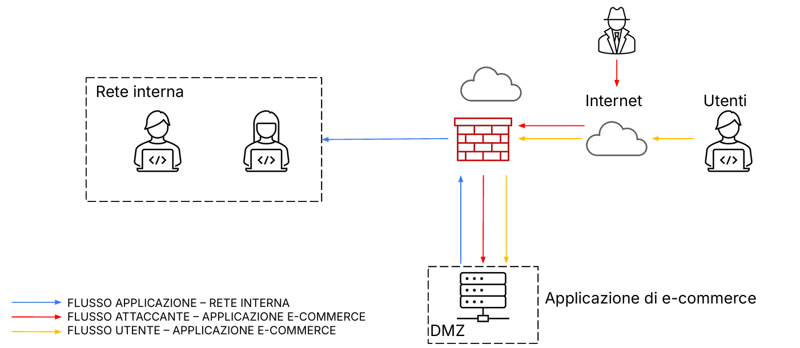
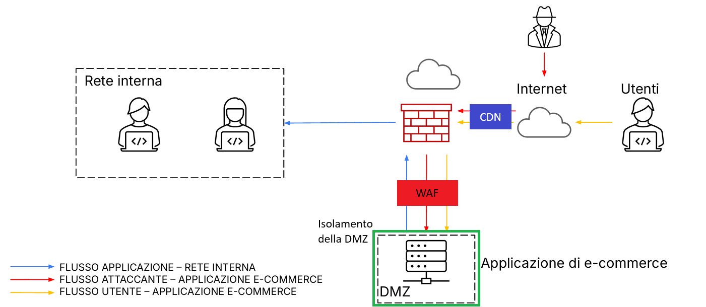

# Security Assessment Report
## Progetto — Analisi delle Minacce e Piano di Risposta

--

## Sommario Esecutivo

Il presente documento riporta i risultati dell'assessment di sicurezza condotto sull'infrastruttura dell'applicazione web di e-commerce. L'analisi ha preso in esame l'architettura di rete esistente, con particolare attenzione alla DMZ esposta su Internet, e ha identificato tre scenari di rischio principali: attacchi applicativi di tipo SQLi e XSS, attacchi volumetrici DDoS con impatto sulla disponibilità del servizio, e infezione da malware con rischio di propagazione laterale alla rete interna.

Per ciascuno scenario vengono proposte misure preventive, una quantificazione dell'impatto economico ove applicabile, e un piano di risposta agli incidenti. Il documento si conclude con una soluzione architetturale integrata che unifica le contromisure identificate.

---

## Architettura di Riferimento

### Descrizione dell'infrastruttura

L'architettura analizzata è composta dai seguenti elementi:

- **Internet / utenti esterni**: accesso pubblico all'applicazione di E-Commerce tramite browser
- **Firewall perimetrale**: unico punto di controllo tra la zona pubblica, la DMZ e la rete interna
- **DMZ**: ospita il server dell'applicazione e-commerce, accessibile sia dall'esterno (utenti e attaccanti) che dall'interno
- **Rete interna**: contiene i sistemi degli sviluppatori e i server di backend; raggiungibile dalla DMZ per policy firewall



---

## Azioni Preventive — Attacchi SQLi e XSS

### Descrizione delle minacce

**SQL Injection (SQLi)** è una tecnica di attacco che consente a un attore malevolo di manipolare le query SQL eseguite dal backend dell'applicazione inserendo codice SQL arbitrario nei campi di input. Un attacco SQLi riuscito può portare a esfiltrazione di dati, bypass dell'autenticazione o distruzione del database.

**Cross-Site Scripting (XSS)** consente all'attaccante di iniettare codice JavaScript malevolo nelle pagine web visualizzate dagli utenti. Può essere utilizzato per furto di sessioni, reindirizzamento a siti fraudolenti o distribuzione di malware agli utenti della piattaforma.

### Misure preventive raccomandate

#### Web Application Firewall (WAF)

Il WAF deve essere posizionato tra il firewall perimetrale e il server applicativo in DMZ. Operando al livello 7 del modello OSI, il WAF analizza il traffico HTTP/HTTPS in ingresso e blocca le richieste contenenti pattern malevoli tipici di SQLi (es. `' OR 1=1 --`) e XSS (es. `<script>alert()</script>`), prima che queste raggiungano l'applicazione.

**Posizionamento**: DMZ, inline tra firewall e server e-commerce.

#### Input Validation e Output Encoding

A livello applicativo, è fondamentale implementare una validazione rigorosa di tutti i dati in ingresso. Per SQLi, l'adozione di **Prepared Statements** (query parametrizzate) elimina la possibilità di iniezione SQL, disaccoppiando il codice SQL dai dati forniti dall'utente. Per XSS, l'**output encoding** contestuale (HTML encoding, JavaScript encoding) garantisce che il contenuto dinamico non venga interpretato come codice eseguibile dal browser.

---

## Impatto sul Business — Attacco DDoS

### Descrizione della minaccia

Un attacco **Distributed Denial of Service (DDoS)** mira a rendere un servizio irraggiungibile saturando le risorse della rete o del server con un volume di traffico abnorme, generato da una rete distribuita di macchine compromesse (botnet). In questo scenario, l'applicazione e-commerce risulta non disponibile per una durata di 10 minuti.

### Calcolo dell'impatto economico

Dati forniti:
- Spesa media per minuto sulla piattaforma: **€ 1.500**
- Durata del disservizio: **10 minuti**

**Impatto economico diretto:**

```
Impatto = Durata (min) × Perdita per minuto (€)
Impatto = 10 × 1.500 €
Impatto = 15.000 €
```

Il valore di **€ 15.000** rappresenta il mancato ricavo diretto imputabile alla non disponibilità del servizio. A questa cifra vanno aggiunti i costi indiretti, tipicamente non quantificabili in modo diretto:

- **Danno reputazionale**
- **Costi di risposta all'incidente**
- **Potenziali penali contrattuali**

### Azioni preventive contro DDoS

**Content Delivery Network (CDN) con protezione DDoS integrata** (es. Cloudflare, AWS Shield, Akamai): posizionata a monte del firewall, la CDN assorbe il traffico volumetrico distribuendo le richieste provenienti dalla rete pubbica. Questa soluzione è in grado di mitigare attacchi da centinaia di Gbps senza impattare il traffico legittimo.

**Rate limiting**: implementazione di regole sul firewall e a livello applicativo che limitano il numero di richieste accettate per IP in un determinato intervallo di tempo, riducendo l'efficacia degli attacchi a bassa intensità.

---

## Incident Response — Infezione da Malware

### Scenario

Il server dell'applicazione e-commerce in DMZ viene infettato da un malware. L'obiettivo prioritario è **impedire la propagazione del malware alla rete interna**, mantenendo al contempo attivo l'accesso dell'attaccante alla macchina infetta (es. per attività di forensics o per non allertare l'attaccante prima di aver raccolto le evidenze necessarie).

### Piano di risposta

#### Fase 1 — Rilevamento e Classificazione

Identificazione dell'infezione tramite gli strumenti di monitoraggio (SIEM, IDS/IPS, log del firewall). Classificazione dell'incidente in base alla natura del malware e alla sua potenziale capacità di movimento laterale.

#### Fase 2 — Contenimento (priorità massima)

L'azione immediata consiste nell'**isolare il server infetto** modificando le policy del firewall in modo da bloccare completamente il traffico tra la DMZ e la rete interna. Questa procedura implementa di fatto una **rete di quarantena**, che consente di contenere l'incidente senza spegnere il sistema, preservando le evidenze forensi.

#### Fase 3 — Analisi

Con il server in quarantena, il team di sicurezza procede all'analisi del malware: tipologia, vettore di infezione, attività svolta, dati potenzialmente esfiltrati. 

#### Fase 4 — Eradicazione e Ripristino

Una volta conclusa l'analisi e raccolte le evidenze, si procede alla bonifica del sistema, al ripristino da backup e al rafforzamento delle difese per prevenire recidive.

---

## Soluzione Completa — Schema Architettura Integrata



## Conclusioni e Raccomandazioni

L'analisi ha evidenziato come l'architettura iniziale presenti un rischio significativo legato alla comunicazione diretta tra DMZ e rete interna, che in caso di compromissione del server esporrebbe l'intera infrastruttura a movimenti laterali dell'attaccante. 

Le principali raccomandazioni in ordine di priorità sono le seguenti. In prima istanza, si suggerisce di implementare un WAF davanti all'applicazione per mitigare attacchi applicativi di tipo SQLi e XSS. In seconda istanza, si consiglia di valutare l'adozione di una CDN con protezione DDoS per ridurre l'esposizione ad attacchi volumetrici e il relativo impatto economico. Infine, in caso di infezione, si deve dare massima priorità all'isolamento del server infetto in modo da limitare la diffusione del virus verso la rete interna. 


